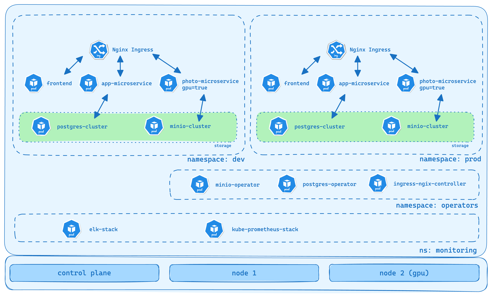

# Kubernetes Cluster Deployment with CI/CD


> **Note:** This project is part of a technical challenge for a company, aimed at designing and implementing a scalable infrastructure solution using **Kubernetes** and **CI/CD** pipelines. The goal is to simulate a production-like environment, deploy multiple microservices, and manage various infrastructure components, such as observability tools and storage solutions.

## Table of Contents

1.  [Overview](#overview)
2.  [Architecture](#architecture)
3.  [Components](#components)
4.  [Getting Started](#getting-started)
    -   [Prerequisites](#prerequisites)
    -   [Setting Up Locally with kind](#setting-up-locally-with-kind)
    -   [Deploying to EKS](#deploying-to-eks)
5.  [CI/CD Workflow](#ci-cd-workflow)
6.  [Technical Decisions](#technical-decisions)
7.  [Directory Structure](#directory-structure)
8.  [Observability](#observability)
9.  [Contributing](#contributing)
10.  [License](#license)

## Overview

This project aims to create a highly available, scalable, and resilient infrastructure using Kubernetes on **Amazon EKS**. It includes automated deployment pipelines for continuous integration and continuous deployment (CI/CD) using **GitHub Actions**, with local development and testing support using **Kubernetes-in-Docker (kind)**.

## Architecture



The architecture consists of:

-   **Microservices**:
    -   **App-Microservice**: A backend service connected to PostgreSQL.
    -   **Photo-Microservice**: Simulates GPU-intensive processing tasks.
    -   **Frontend**: A web interface for user interactions.
-   **Storage Backend**:
    -   **MinIO** for storing unstructured data (e.g., images, documents).
    -   **PostgreSQL** for structured data with high availability managed via the Zalando PostgreSQL Operator.
-   **Observability Stack**:
    -   **Prometheus** and **Grafana** for monitoring.
    -   **EFK Stack (Elasticsearch, Fluentd, Kibana)** for logging.
-   **Ingress Controller**: NGINX for routing traffic.
-   **CI/CD Pipeline**: Automated workflows using **GitHub Actions**.

## Components

### 1. Microservices

-   **App-Microservice**: Manages business logic and communicates with the PostgreSQL database.
-   **Photo-Microservice**: Performs simulated GPU processing tasks and integrates with MinIO for file storage.
-   **Frontend**: Provides the web interface for users.

### 2. Storage

-   **MinIO**: Acts as an S3-compatible storage backend.
-   **PostgreSQL**: Uses the Zalando PostgreSQL Operator for high availability.

### 3. Observability

-   **Prometheus and Grafana**: Monitor metrics and visualize system performance.
-   **EFK Stack**: Manages logs for troubleshooting and monitoring.

### 4. Ingress

-   **NGINX Ingress Controller**: Manages external access and traffic routing.

## Getting Started

### Prerequisites

Before setting up the project, ensure you have the following:

-   **Docker** installed for local development.
-   **kubectl** and **Helm** installed for Kubernetes management.
-   **AWS CLI** configured with access to your **AWS account**.
-   **Kind** (Kubernetes in Docker) for local development.
-   **GitHub repository** where the project is hosted.

### Setting Up Locally with kind

To simulate the Kubernetes cluster locally using kind:

1.  **Create a kind Cluster**:
    
    ```bash   
    kind create cluster --config scripts/kind/kind-config.yaml
    ```
    The `kind-config.yaml` should define a multi-node setup, including GPU and non-GPU nodes.

2. **Create the namespaces**

    ```bash   
    ./scripts/create-namespaces.sh
    ```
    This script create the namespaces for the enviroments staging, dev and prod.

3. **Install the operators**

    ```bash   
    ./scripts/install-operators.sh
    ```
    This script install the operators.

4. **Build and load images in Kind**

    ```bash
    docker build -t app-microservice:1.0 ./microservices/app-microservice/
    docker build -t photo-microservice:1.0 ./microservices/photo-microservice/
    kind load docker-image app-microservice:1.0 --name kind
    kind load docker-image photo-microservice:1.0 --name kind 
    ```

5.  **Deploy the Application**:
    
    ```bash
    kubectl apply -k kubernetes/overlays/dev
    ```
6.  **Access the Application**:

    -   Use port-forwarding or configure an Ingress to access the services locally.
    ```bash
    kubectl port-forward -n ingress-nginx svc/ingress-nginx-controller 8080:80
    ```

## CI/CD Workflow

The CI/CD pipeline is managed through **GitHub Actions**, with the following steps:

1.  **Build Docker Images** for the microservices.
2.  **Push Docker Images** to **Amazon ECR**.
3.  **Deploy or Update** the Kubernetes resources in **Amazon EKS** using **Helm** and **Kustomize**.
4.  **Post-Deployment Tasks**: Run tests or notify teams.

The workflow file is located at `.github/workflows/deploy-kubernetes-dev.yml`.

## Technical Decisions

1.  **Kubernetes Cluster Setup**: Uses kind for local simulation and EKS for production.
2.  **PostgreSQL High Availability**: Managed with the Zalando PostgreSQL Operator.
3.  **Storage Backend**: MinIO for object storage.
4.  **Observability Tools**: Prometheus, Grafana, and the EFK Stack.
5.  **Ingress Controller**: NGINX for routing and SSL termination.
6.  **CI/CD Pipeline**: Automated with GitHub Actions.
7.  **Node Scheduling**: Uses node affinity and taints to separate GPU and non-GPU workloads.

## Directory Structure

```
project-root/
├── .github/
│   └── workflows/
│       └── deploy-kubernetes-dev.yml     # GitHub Actions workflow for CI/CD
│       └── deploy-kubernetes-prod.yml    # GitHub Actions workflow for CI/CD
├── helm-charts/
│   ├── app-microservice/
│   ├── photo-microservice/
│   └── monitoring/
├── kubernetes/
│   ├── base/                    # Base Kubernetes manifests
│   └── overlays/
│       ├── dev/                 # Kustomize overlay for development environment
│       ├── staging/             # Kustomize overlay for staging environment
│       └── prod/                # Kustomize overlay for production environment
├── microservices/
│   ├── app-microservice/
│   ├── photo-microservice/
└── README.md
````

## Observability

The observability stack consists of:

1.  **Prometheus**: Scrapes metrics from microservices and infrastructure.
2.  **Grafana**: Provides dashboards for visualizing metrics.
3.  **Elasticsearch, Fluentd, Kibana (EFK)**: Manages log aggregation and analysis (#TODO)

### How to Access

-   **Prometheus**: Access via port-forwarding or an Ingress URL.
-   **Grafana**: Default username is `admin`. Password is configured in the Helm values file.
-   **Kibana**: Accessible through the configured Ingress or port-forwarding. (#TODO)

